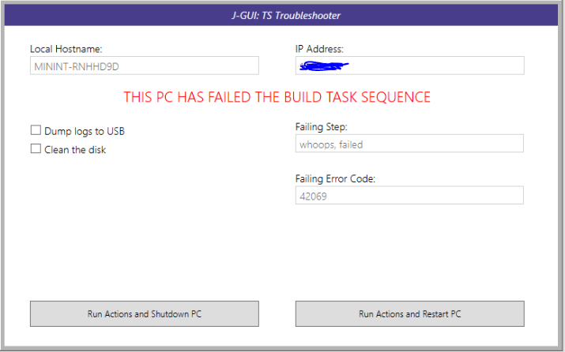
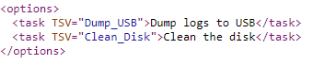
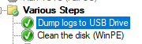
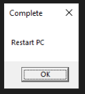
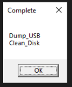

# J-GUI: TS Troubleshooter #

-------------------

Since F8 is not a great thing to have enabled within Task Sequences, I made an app to run on failure state that gives users the ability to do their own basic troubleshooting.

This is J-GUI: TS Troubleshooter



When it launches, it grabs the local hostname of the Windows instance.<br>
If this is in WindowsPE, this will be a 'minint-' name, to assist in identifing the offending PC in MCM logs.<br>
It will also display the current IP address.

Next, it will load avaliable option from a defined xml file.<br>
In the screenshot, dumping logs to a USB and cleaning the disk are defined.


When the app is run, it will populate each item in the XML as a selectable option.<br>
You pick what options you want run, then hit if you want the machine to shut down, or restart.<br>
The idea being you can build a troubleshooting task sequence, that will only run the selected steps.


If running in a test, outside of a task sequence, pressing 'shut down' or 'restart', will get this instead of a power off.<br>



### XML Format 

This is the format of the XML file (case sensitivity does not matter)<br>
```
<?xml version="1.0" encoding="utf-8" ?>
<options>
	<task TSV="Dump_USB">Dump logs to USB</task>
	<task TSV="Clean_Disk">Clean the disk</task>
</options>
```

By default, the app will look for config.xml in the same directory it is run from.
Otherwise you can define it in an argument. Either a website or file share will work.<br>
```
J-GUI_TS_Troubleshooter.exe http://coolwebsite/config.xml
```
or
```
J-GUI_TS_Troubleshooter.exe C:\Temp\this.xml
```
or
```
J-GUI_TS_Troubleshooter.exe \\fileshare\folder1\bing.xml
```
It'll throw an error if it can't find or access the file specified.

When run outside a Task Sequence, it will throw a pop-up with what variable would be saved if it was in a TS.<br>
